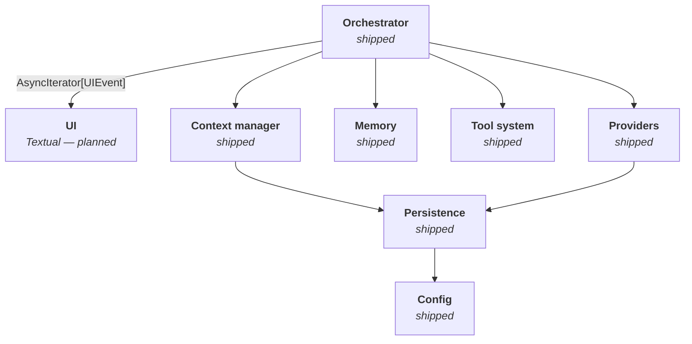

# Architecture

Cairn is a personal LLM harness: a single-user terminal application that
wraps one or more language models with persistent memory, tool use, and
multi-session management.

This document describes the overall shape of the system. For configuration,
see [configuration.md](configuration.md); for *why* specific structural
decisions were made, see the [ADRs](decisions/README.md).

## Design principles

1. **Companion-first, tool-aware.** The primary surface is a long-lived
   relationship, not a task queue. The companion knows about tools and
   delegates when appropriate.
2. **Identity stable across model swaps.** Upgrading the underlying model
   is a config change. Soul, memory, and accumulated context persist.
3. **Memory-first.** Three-tier memory (observations, reflections, curated
   MEMORY.md) is designed before the first turn.
4. **Model-agnostic core.** Nothing above the provider adapter layer knows
   which vendor is in use.
5. **UI-agnostic core.** The agent layer does not import from `textual`.
   It communicates with any UI through a narrow event interface.
6. **Transparency over magic.** Tool calls, delegations, compactions,
   memory writes, and costs are observable.

## Session types

Three sibling session types, each with distinct memory + tool semantics:

| Type | Memory space | Tools | Purpose |
|---|---|---|---|
| **Companion** | `companion` (or config override) | Full tool set | Primary, long-lived relationship |
| **Persona** | Named space or `None` | Per-persona allowlist | Alternative identities (work assistant, writing coach, etc.) |
| **Ephemeral** | `None` | None by default | One-shot queries, model trials, no memory writes |

Memory-space isolation is enforced at the repository layer — not at call
sites. Nothing in a persona session can read companion memory; nothing in
an ephemeral session writes memory anywhere.

## Bricks

Cairn is built as a stack of independent bricks, each with a narrow
responsibility and a clean protocol-shaped boundary. Bricks are
independently testable and, where reasonable, independently swappable.

Each brick at a glance:

| Brick | Responsibility |
|---|---|
| **UI** *(planned)* | Chat screen, session list, command bar, `/commands` |
| **Orchestrator** | Turn loop, state machine, middleware chains, cancellation |
| **Context manager** | Assembles the provider request: soul, memory, conventions, history |
| **Memory** | Tier-1 observation extraction, retrieval, MEMORY.md loading |
| **Tool system** | Decorator, registry, runner, delegation, security middleware |
| **Providers** | Anthropic, OpenAI, OpenRouter adapters behind a narrow protocol |
| **Persistence** | Sessions, messages, tool calls, turns, usage, memory entries |
| **Config** | Schema-versioned TOML, profiles, secret references |

## Data flow of a companion turn

1. User submits a message in the UI.
2. **Orchestrator** persists the user message and opens a turn.
3. **Memory service** retrieves relevant memories for the session's
   memory space.
4. **Context manager** assembles the provider request: soul document +
   user context + MEMORY.md + retrieved memories + convention files +
   tool schemas + conversation history + latest user turn.
5. **Provider** streams tokens; the orchestrator translates them to UI
   events (`AssistantTextDelta`, `ToolCallPlanned`, etc.) and back-pressures
   the stream against the UI.
6. If the model emits tool calls:
   - **Tool system** walks each call through the approval + execution
     lifecycle
     (`pending → (approved → executing → completed | failed | timed_out) | rejected`).
   - Results are appended to the session and the loop iterates.
   - **Delegation tools** spawn an ephemeral sub-session against a
     different model; the response is returned to the companion as a
     regular tool result.
7. When the model stops without emitting more tool calls, the
   orchestrator persists the final assistant message and records usage.
8. **Extraction queue** (post-turn, async) runs observation extraction
   for sessions with a memory space. The user is never blocked on this.

## Trust and security

The tool system is the highest-stakes surface.

- **Spotlighting** — tool results are wrapped with trust labels before
  being fed back to the model.
- **Invisible-Unicode stripping** — applied to all external content.
- **Approval gates** — tools are tiered (0 to 4+); Tier 4+ require
  per-call user approval in V1.
- **Session-scoped tool visibility** — ephemeral sessions get no tools by
  default; personas have a per-config allowlist; companion sees the full
  set.
- **Cost caps** — per-turn (iteration), per-session (USD), daily (USD).
  Enforced from the usage records.
- **Secret redaction** — structured logs are passed through a redaction
  processor. Pattern-based matching for common API-key shapes.

## Currently shipped vs. planned

Cairn is under active development. This table is authoritative; the
`CHANGELOG.md` records the version each brick landed in.

| Brick | Status |
|---|---|
| Configuration | Shipped (0.1.0) |
| Domain types | Shipped (0.2.0) |
| Providers (Anthropic, OpenAI, OpenRouter) | Shipped (0.2.0) |
| Persistence (sessions, messages, tool calls, usage) | Shipped (0.3.0) |
| Orchestrator | Shipped (0.4.0) |
| Tool system — foundation + built-in tools | Shipped (0.5.0) |
| Tool system — runner + delegation + orchestrator integration | Shipped (0.6.0) |
| Observability — bootstrap modules | Shipped (0.7.0) |
| Memory (tier-1) — extraction, retrieval, context assembly | Shipped (0.7.0) |
| Compaction | Shipped (0.8.0) |
| Convention files | Shipped (0.9.0) |
| UI (Textual) | Planned |
| CLI entry point | Planned |
| Observability — tranche 2 (structured observer) | Planned |
| Reflection (tier-2 memory) | V2 |
| Knowledge graph | V2 |
| MCP client | V2 |
| Skills, subagents | V2+ |
| Vector memory | V3 |

## Related documents

- [Configuration](configuration.md) — TOML reference.
- [Providers](providers.md) — per-provider notes.
- [Persistence](persistence.md) — on-disk layout.
- [Orchestrator](orchestrator.md) — the turn loop.
- [Tools](tools.md) — tool system, built-in catalogue, security primitives.
- [Memory](memory.md) — tier-1 extraction, retrieval, MEMORY.md loading.
- [ADRs](decisions/README.md) — the *why* behind non-obvious decisions.
