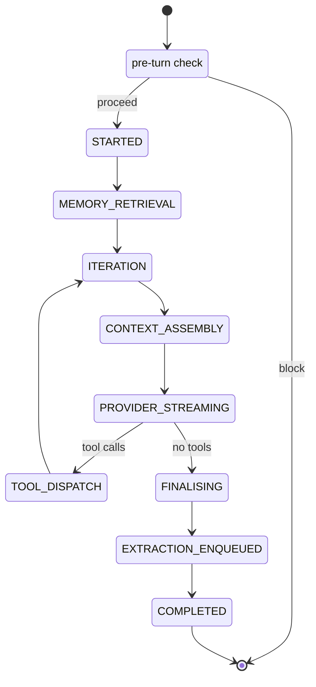

# Orchestrator

The orchestrator is cairn's turn loop: the one place that ties
providers, persistence, memory, tools, context assembly, and the UI
together. It is intentionally the most composed brick in the project —
everything else participates in the turn lifecycle by implementing a
narrow protocol that the orchestrator consumes.

## Shape

```python
Orchestrator(
    # Core collaborators (injected protocols)
    provider_registry=...,   # ProviderRegistry
    model_registry=...,      # ModelRegistry
    session_manager=...,     # SessionManager
    context_manager=...,     # ContextManager — assembles ProviderRequest
    tool_registry=...,       # ToolRegistry — scoped tool discovery
    tool_runner=...,         # ToolRunner — per-tool lifecycle
    memory_service=...,      # MemoryService — retrieval
    extraction_queue=...,    # ExtractionQueue — async post-turn work
    approval_gateway=...,    # ApprovalGateway — terminal approver
    cost_tracker=...,        # CostTracker — record + budget verdict
    turn_repo=...,           # TurnRepo
    message_repo=...,        # MessageRepo
    clock=...,               # Clock
    config=OrchestratorConfig(),

    # Middleware chains (ordered, default empty)
    preparers=[...],         # MessagePreparer — rewrite request
    approvers=[...],         # ToolApprover — gate tool execution
    transformers=[...],      # ResultTransformer — scrub tool results
    observers=[...],         # UIEventObserver — sync fan-out
)
```

## Public API

| Method | Purpose |
|---|---|
| `start_session(*, type, persona, model?, memory_space?) -> Session` | Create a new session, emit `SessionCreated`. |
| `resume_session(session_id) -> Session` | Fetch an existing session, emit `SessionResumed`. |
| `archive_session(session_id)` | Archive, emit `SessionArchived`. |
| `run_turn(session_id, user_msg) -> AsyncIterator[UIEvent]` | Run one turn. Yields events. |
| `cancel(session_id)` | Signal cancellation. The in-flight turn (if any) ends in `TurnAborted`. |
| `resume_aborted_turns() -> list[str]` | Mark any turns left non-terminal by a prior crash as `ABORTED`. Returns the session IDs affected. |

## Turn lifecycle

Every turn walks an explicit state machine. The `turns` table's
`state` column is authoritative; transitions are conditional `UPDATE`
statements.



Notes on the transitions:

- **pre-turn check** runs `CostTracker.should_block_turn`. `BLOCK`
  emits `TurnBlocked` and returns. `WARN` proceeds and emits
  `BudgetWarning`. `PROCEED` proceeds silently.
- **STARTED** is reached after the user message is persisted and the
  `turns` row is inserted.
- **MEMORY_RETRIEVAL** is skipped for memoryless sessions (ephemeral,
  or persona with `memory_space = None`).
- **EXTRACTION_ENQUEUED** is skipped for ephemeral or memoryless
  sessions; the queued task is what runs observation extraction
  asynchronously after the turn returns.
- **COMPLETED** emits `TurnComplete(stop_reason)`.
- **ABORTED** is reachable from any state via user cancel, process
  crash, or unrecoverable error. The `turns` row's `state` column is
  conditionally updated; the previous state is recorded in
  `aborted_from`.

Each transition:

1. Updates the `turns` row (conditional `UPDATE`; invalid transitions
   raise `InvalidTurnTransition`).
2. Emits a structured log record.
3. Emits a `UIEvent` when there's a public-facing event for the
   transition (not every state has one — `MEMORY_RETRIEVAL` is
   internal).

## UI events

All events carry `turn_id` (except session-lifecycle events, which are
pre-/post-turn). The full union:

| Event | When |
|---|---|
| `UserMessagePersisted` | User message written, turn row inserted |
| `AssistantTextDelta` | Per-token text chunk from the provider |
| `AssistantMessageComplete` | Assistant message persisted, usage recorded |
| `ToolCallPlanned` | Model emitted a tool call; approval pending |
| `ToolCallApproved` | An approver cleared the call |
| `ToolCallRejected` | An approver (or gateway) blocked it |
| `ToolCallStarted` | Execution began |
| `ToolCallCompleted` | Execution finished (status + is_error on the event) |
| `DelegationSpawned` / `DelegationCompleted` | Not yet emitted — see *Dispatch and delegation* below. |
| `ObservationExtractionRequested` | Post-turn extraction enqueued |
| `TurnComplete` | Clean completion + stop_reason |
| `TurnAborted` | User cancel / crash / error |
| `TurnBlocked` | Pre-turn budget check blocked |
| `TurnIncomplete` | Ran into `max_tokens` mid-tool-call |
| `BudgetWarning` | Crossed the soft-warn threshold |
| `SessionCreated` / `SessionResumed` / `SessionArchived` | Lifecycle |

## Extensibility — four middleware seams

1. **`MessagePreparer`** — `prepare(request, ctx) -> request`. Rewrites
   the `ProviderRequest` before the model sees it. Canonical uses:
   memory injection, compaction, prompt-cache markers.
2. **`ToolApprover`** — `decide(request, ctx) -> ApprovalDecision`.
   Returns APPROVE, REJECT, or ESCALATE. First non-ESCALATE wins; if
   the chain exhausts, the `ApprovalGateway` is the terminal authority.
3. **`ResultTransformer`** — `transform(result, tool_call, ctx) -> result`.
   Rewrites a tool result before it's appended to the session.
   Canonical uses: spotlighting (security-doc §3), invisible-Unicode
   stripping, secret redaction.
4. **`UIEventObserver`** — `observe(event)`. Sync, side-effecting,
   can't mutate, can't back-pressure. Failed observers are logged and
   swallowed. Canonical uses: structured logging, metrics, cost
   dashboards.

All four are ordered lists, registered at construction. Defaults are
empty — each brick that needs middleware supplies its own at the
harness-assembly layer (CLI entry point).

## Error and retry policy

Three layers:

- **Provider transport** (retries: 5xx, 429) — inside the SDK / adapter.
- **Orchestrator** (model-behaviour retries: malformed tool-call JSON,
  unknown tool name) — feeds a tool-error result back to the model.
  Capped by `max_model_behaviour_retries` (default 2).

Iteration loops are capped by `OrchestratorConfig.max_iterations`
(default 10). Wall-clock cap per turn is
`max_turn_duration_s` (default 600s).

## Cancellation

`Orchestrator.cancel(session_id)` sets a per-session `asyncio.Event`.
The turn loop checks between awaits. On cancel:

1. `CancelledError` raised at the next await.
2. Outer handler persists whatever's committable: the partial
   assistant message (if any), the user message (already persisted),
   any completed tool calls.
3. `turns` row transitions to `ABORTED` with `aborted_reason='user_cancel'`.
4. `TurnAborted` emitted to observers + caller.

Ephemeral artefacts (in-flight tool invocations that had already
started) remain their tool-run layer's concern — the orchestrator
does not try to unwind partial tool execution.

## Crash recovery

On application startup, call `await orch.resume_aborted_turns()`. The
repo scans for `turns.state NOT IN ('completed', 'aborted')` and marks
every match `ABORTED` with `aborted_reason='process_crash'`. The method
returns the set of affected session IDs so the UI can surface a
"resume from your message?" prompt.

Mid-stream tokens are not replayed (LLM output isn't deterministic).
If a tool call had already *completed* before the crash, its result is
in the DB — a future "continue from stored results" affordance can use
that, but V1 default is "re-ask".

## Budget enforcement

The orchestrator enforces two scopes directly:

- **Per-turn iteration cap** (`OrchestratorConfig.max_iterations`)
  — the tool loop's for-loop bound.
- **Per-session and daily spend caps** via
  `CostTracker.should_block_turn()`. `BLOCK` short-circuits the turn
  before any writes; `WARN` proceeds but emits `BudgetWarning`.

Per-delegation cost caps live inside `DelegationTool.invoke` — when
the accumulated sub-session cost exceeds `DelegationToolConfig.max_cost_usd`
the stream breaks early and the result carries a truncation note.

## Dispatch and delegation

When the model emits a tool call, the orchestrator walks each call
through approval, runs it via the injected `ToolRunner`, applies the
result-transformer chain, and re-joins the streamed results into the
next iteration.

The responsibility split with the runner:

- **Orchestrator** owns the approval chain (`ToolApprover` middleware
  then the terminal `ApprovalGateway`), emits all `ToolCallPlanned /
  Approved / Rejected / Started / Completed` events, applies the
  `ResultTransformer` chain, and measures per-call duration.
- **Runner** (`DefaultToolRunner` in `cairn.tools`) owns the
  `tool_calls` and `approval_decisions` DB writes, `asyncio.timeout`
  enforcement around `tool.invoke`, and synthesising an error
  `ToolResultBlock` when the decision is REJECT or the call fails.

The runner is called **once per tool call, on both approve and reject
paths** — so the approval audit row in `approval_decisions` always
lands regardless of outcome.

### Delegation events are not yet emitted

`DelegationSpawned` and `DelegationCompleted` are defined in the
domain event union and `DelegationTool` exists, but the orchestrator
currently does not emit them. The sub-session's ID is created inside
`DelegationTool.invoke()` and the `Tool` protocol has no back-channel
to report it to the orchestrator. Resolving this needs either a
callback on `TurnContext` or a post-hoc `SessionRepo.children_of()`
query; deferred to a follow-up. Users can still observe delegation
activity via `UsageRepo` rows where `operation = delegation` and via
`SessionRepo.children_of(parent)`.

## Protocols and stubs

Every collaborator the orchestrator consumes is a protocol. Default
stubs are shipped in `cairn.orchestrator`:

| Protocol | Default stub | Behaviour |
|---|---|---|
| `ContextManager` | `MinimalContextManager` | Passes through; no compaction. |
| `MemoryService` | `NullMemoryService` | Returns `[]`. |
| `ExtractionQueue` | `NullExtractionQueue` | No-op submit. |
| `ToolRegistry` | `EmptyToolRegistry` | No tools. |
| `ToolRunner` | `RaisingToolRunner` | Raises; safe because `EmptyToolRegistry` gives it nothing to run. |
| `ApprovalGateway` | `AutoApproveGateway` / `DenyAllGateway` | Approve-all / deny-all. |
| `Clock` | `SystemClock` (prod), `FrozenClock` (tests) | Wall clock / deterministic. |
| `CostTracker` | `BasicCostTracker` | Fully functional against `UsageRepo`. |

Real implementations land with their respective bricks. `ToolRegistry`
and `ToolRunner` now have real implementations in `cairn.tools`
(`DefaultToolRegistry`, `DefaultToolRunner`) and are what the harness
wires in at startup; the stubs remain for tests and for orchestrator
unit tests that need to exercise the turn loop without real tools.
`MemoryService` and `ApprovalGateway` stubs still ship as the default
— the memory brick and the UI's real approval gateway are still to
land. The orchestrator can be constructed and fully tested today with
any mix of stubs and real implementations.

## Related ADRs

- [0009 — Protocol-shaped collaborators with default stubs](decisions/0009-protocol-stubs.md)
- [0010 — Typed middleware over generic lifecycle hooks](decisions/0010-typed-middleware.md)
- [0011 — `turns` table with an explicit state machine](decisions/0011-explicit-turn-state-machine.md)
- [0012 — No FK on `turn_id` columns](decisions/0012-no-fk-on-turn-id.md)
